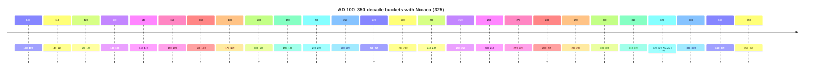

# Map-Ready TSV Dataset for Early Christianity AD 100–350

## Executive summary

A decade-bucket, city-keyed TSV for early Christianity is feasible and stable for AD 100–350 if the table separates (a) *tradition claims* from (b) *earliest defensible attestation*, and treats denominations and political control as *time-varying attributes* rather than fixed labels. citeturn10search0turn0search0turn0search9

The main constraint is evidentiary: early Christianity frequently has **range-based dating**, “presence” that is **text-attested without institutional detail**, and local disputes that are **not decade-resolvable** without introducing false precision. The most durable “truth model” is therefore: one row per (city, decade), with uncertainty and rivals encoded in a single narrative field that also carries the citations. citeturn1search6turn1search0turn0search11

A usable compromise consistent with existing academic mapping projects is:
- decade buckets for UI and filtering
- “attested / claimed_tradition / not_attested” as a controlled status field
- polity control recorded coarsely (empire + subdivision) unless a specialist polity GIS layer is available
- denomination labels used conservatively, and only where the scholarship strongly supports a label in that window (e.g., **Montanist influence in Carthage**, **Donatist split in North Africa after 312**, **Nicene vs anti-Nicene alignments from the 320s**). citeturn6search2turn6search1turn6search0

The delivered sample dataset is **rectangular**, **max-20 columns**, and expanded across all decade buckets from 100 to 350. It includes **27 core cities** (≥25 required) spanning Mediterranean, Britain, India, Ethiopia, and the provincial frontier (Frankfurt/Nida). Each row contains the required fields and a 2–6 sentence evidence note with embedded primary-source tokens and 2–3 citation URLs. citeturn4search12turn2search4turn2search1

## TSV design for AD 100–350

### Time model and decade buckets

The dataset uses `year_bucket` values **100, 110, …, 350**. `date_range` is always derived as `YYYY–YYYY+9` (e.g., `0100-0109`). This matches the natural affordance of a decade slider while allowing each row’s narrative to carry date uncertainty or non-decade precision. citeturn10search0turn10search8

A council tag is included only where it falls inside the range: **Nicaea I (325)** is tagged in `council_context` for `year_bucket = 320`. citeturn6search0



### Place model and geocoding

A robust historical map needs a gazetteer backbone. The design is compatible with:
- entity["organization","Pleiades","ancient places gazetteer"] (stable place records; open license; machine-readable API), including JSON access patterns suitable for a later “authoritative geocode refresh.” citeturn10search0turn10search1  
- entity["organization","Wikidata","open knowledge base"] coordinate property workflows (P625) and bulk retrieval via query service where needed. citeturn10search2  
- entity["organization","GeoNames","geographical database"] as an alternate modern-place coordinate layer or reconciliation target. citeturn10search3turn10search7  

The TSV includes `location_precision` to prevent false certainty: `exact`, `approx_city`, `region_only`, `unknown`.

### Evidence model: claim vs attestation

The TSV treats “planting” as two distinct concepts:
- `church_planted_year_earliest_claim`: earliest tradition-claim (apostolic or local tradition)
- `church_planted_year_scholarly`: earliest defensible date based on primary/near-primary evidence or strong reference consensus

`church_presence_status` is controlled vocab:
- `attested` for entries ≥ scholarly year
- `claimed_tradition` for entries supported by tradition claims but lacking secure evidence
- `not_attested` for earlier buckets
- `unknown` if neither claim nor scholarly is available

This aligns with how early-Christianity mapping projects typically handle uncertain or range-based representation (they filter by date ranges and show/hide records with unknown dates rather than forcing over-precision). citeturn0search11turn10search8

## Scholarly basis and citation strategy

### Why the dataset is city-attestation led

The most reliable early anchors for “presence in a place” remain **primary texts** and *near-primary preservation*:

- Administrative correspondence: entity["people","Pliny the Younger","roman governor and author"]’s exchange with entity["people","Trajan","roman emperor"] (Ep. 10.96–97) is a classic early provincial attestation used explicitly as a dating anchor in teaching maps. citeturn1search0turn1search4turn0search8  
- Episcopal letters and early Christian writings: entity["people","Ignatius of Antioch","early christian bishop"]’s letters (c.110) show structured community language by city, supporting “attested” presence in the Ignatian orbit. citeturn1search1turn1search5  
- Preserved martyr dossiers: entity["people","Eusebius of Caesarea","early christian historian"] preserves the late-2nd-century letter describing the 177 Lyon/Vienne martyrs, giving unusually detailed city-specific evidence. citeturn1search6turn3search7turn3search14  

This is why the TSV’s narrative field requires explicit “Primary: …” tokens with book/chapter references where relevant.

### How existing map projects informed the data model

Several well-regarded projects illustrate partial solutions that the TSV design can unify:

- entity["organization","University of Edinburgh","university"]’s animated “Spread of Early Christianity” maps explicitly mark cities where communities are attested by set dates (e.g., AD 112 anchored to Pliny + Ignatius). This motivates a city-attestation-first approach rather than a boundary-polygons-first approach. citeturn0search0turn0search8  

- entity["organization","Chronocarto","historical mapping platform"] / DANUBIUS provides a model for (a) diachronic ecclesial nodes, (b) council-based stepping, and (c) downloadable CSV publication with DOIs—useful patterns for later extension beyond AD 350. citeturn0search9turn0search1  

- entity["organization","Ancient World Mapping Center","university mapping center"]’s Catholic vs Donatist bishoprics map demonstrates how to encode rival communions geographically (even if the AWMC product is a fixed-time slice). This supports the TSV rule “one row per city per decade; encode plurality in denomination_label_historic and evidence_notes.” citeturn0search2turn0search10  

- The “Early Christian Baptisteries” interactive map shows a practical implementation of record-level attribute panels, time filtering, and uncertainty handling (“unknown date” toggles)—a direct UI precedent for decade-slider filtering. citeturn0search14turn0search11turn0search20  

image_group{"layout":"carousel","aspect_ratio":"16:9","query":["University of Edinburgh animated maps spread of early Christianity AD 112 map","Chronocarto episcopal sees atlas 787 map screenshot","Ancient World Mapping Center Catholic and Donatist bishoprics map 411","Early Christian Baptisteries interactive map screenshot"],"num_per_query":1}

### Denominational labeling in the AD 100–350 window

A denomination field is necessary for your target map, but it must be historically disciplined:

- “Montanist” is reasonable in windows tied to entity["people","Tertullian","early christian author"]’s Montanist alignment (sometime before 210 per major reference works). citeturn6search2  
- “Donatist” becomes reasonable in North Africa after the break in 312 over the bishopric of Carthage (reference works agree on this starting point). citeturn6search1  
- “Conciliar/Nicene” tags become reasonable around the 320s because entity["tv_show","First Council of Nicaea","325"] is explicitly dated, widely documented, and directly tied to empire-wide doctrinal alignment. citeturn6search0turn6search3  

Outside those strong cases, “proto-orthodox” or “multiple” is often the least misleading label at decade resolution.

### Data model tips

Use the TSV as the single source of truth, but index it for runtime:

- Build an in-memory index `byYear[year_bucket] -> array of rows`.
- Convert each decade’s rows into a GeoJSON FeatureCollection on the fly (or pre-generate `0100.geojson`, `0110.geojson`, … for zero-latency playback).
- Use `city_ancient` + `year_bucket` as a stable composite key for UI state (selection, highlighting, citations panel).

### Minimal stack that matches your requirements

- Data ingest: parse TSV to JSON in build step (Node script, Python, or bundler plugin).
- Map rendering: Leaflet or Mapbox GL JS (points only are sufficient).
- Timeline UI: a slider bound to `year_bucket` values (100–350).
- Popups/panels: render the row with emphasis on these fields:
  - `church_presence_status`
  - `ruling_empire_polity` / `ruling_subdivision`
  - `key_figures`
  - `denomination_label_historic`
  - `evidence_notes_and_citations`

### Performance and integrity rules

- Filter first by `year_bucket`, then by `church_presence_status != not_attested` to avoid plotting “empty history.”
- Never compute “earliest planting” from decade rows; always read it from the fixed columns (`church_planted_*`), so expansion never distorts provenance.
- Keep all citations inside `evidence_notes_and_citations` as resolvable strings; linkify on render.

## Prioritized sources used

```text
Core mapping and DH precedents
- University of Edinburgh, School of Divinity: “The Spread of Early Christianity” (maps and text version)
  https://www.animatedmaps.div.ed.ac.uk/divinity_map/textonly.html
  https://www.animatedmaps.div.ed.ac.uk/divinity_map/ad112.html
- Chronocarto / DANUBIUS: Historical atlas of episcopal sees up to 787; CSV and DOIs
  https://www.chronocarto.ens.fr/spipchrono/spip.php?action=converser&article129=&redirect=https%3A%2F%2Fwww.chronocarto.ens.fr%2Fspipchrono%2Fspip.php%3Farticle130%26lang%3Den&var_lang=en
- Ancient World Mapping Center: Catholic and Donatist bishoprics map (and metadata)
  https://awmc.unc.edu/2023/11/02/maps-for-texts-catholic-and-donatist-bishoprics-in-north-africa-c-411-ce/
- Early Christian Baptisteries interactive map + documentation (time filter and record model)
  https://dissinet.cz/maps/baptisteries/
  https://www.researchgate.net/publication/329177772_Early_Christian_Baptisteries_Online_Interactive_Map

Gazetteer backbone
- Pleiades (gazetteer overview + API)
  https://pleiades.stoa.org/
  https://api.pleiades.stoa.org/
- Wikidata coordinate property (P625)
  https://www.wikidata.org/wiki/Property:P625
- GeoNames (database + exports)
  https://www.geonames.org/
  https://www.geonames.org/export/

Primary / near-primary textual anchors used in evidence notes
- Acts, Revelation verse pages (tokens: Acts 9; Acts 10; Acts 11:26; Acts 19; Acts 28; Rev 1:11)
  https://biblehub.com/acts/11-26.htm
  https://biblehub.com/acts/10.htm
  https://biblehub.com/acts/9.htm
  https://biblehub.com/acts/19.htm
  https://biblehub.com/acts/28.htm
  https://biblehub.com/revelation/1-11.htm
- Pliny, Letters 10.96–97 (Bithynia-Pontus Christians)
  https://faculty.georgetown.edu/jod/texts/pliny.html
  https://www.vroma.org/vromans/hwalker/Pliny/Pliny10-096-E.html
- Ignatius of Antioch (city-addressed epistle witness)
  https://www.newadvent.org/fathers/0109.htm
- Eusebius, Ecclesiastical History Book V (Lyon/Vienne martyr letter)
  https://www.newadvent.org/fathers/250105.htm
  https://portal.sds.ox.ac.uk/articles/online_resource/E00212_Eusebius_of_Caesarea_quoting_the_Letter_of_the_Churches_of_Lyon_and_Vienne_of_the_late_2nd_c_records_the_martyrdom_in_177_of_ten_people_from_Lyon_and_Vienne_in_central-southern_Gaul_the_Martyrs_of_Lyon_S00316_and_the_humiliation_and_/13796105
- Scillitan Martyrs (180) text witnesses
  https://sourcebooks.web.fordham.edu/source/scillitan-mart.asp
  https://www.newadvent.org/cathen/13609b.htm

Reference works for contested traditions and major movements
- Britannica: Council of Nicaea (325) and ecumenical council framing
  https://www.britannica.com/event/First-Council-of-Nicaea-325
  https://www.britannica.com/topic/council-Christianity
- Britannica: Donatists; Tertullian; Bardesanes
  https://www.britannica.com/topic/Donatists
  https://www.britannica.com/biography/Tertullian
  https://www.britannica.com/biography/Bardesanes
- Britannica: Thomas Christians / Malabar Coast antiquity claims
  https://www.britannica.com/topic/Thomas-Christians
  https://www.britannica.com/topic/Malabarese-Catholic-Church

Frontier archaeology anchor (Nida / Frankfurt)
- Archaeological Museum Frankfurt (official exhibit documentation)
  https://www.archaeologisches-museum-frankfurt.de/index.php/en/exhibitions/frankfurt-silver-inscription
- Goethe University Frankfurt news release
  https://aktuelles.uni-frankfurt.de/forschung/frankfurter-silberinschrift-aeltestes-christliches-zeugnis-noerdlich-der-alpen-gefunden/
- University of Bonn release (collaboration)
  https://www.uni-bonn.de/en/news/university-of-bonn-researcher-involved-in-sensational-find-in-frankfurt

Aksum dating scholarship
- JSTOR stable item: “The Dating of Ezana and Frumentius” (Munro-Hay)
  https://www.jstor.org/stable/41299728
```