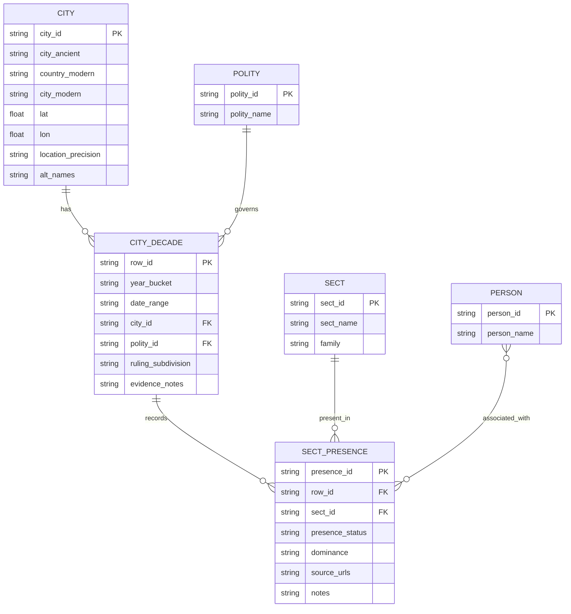
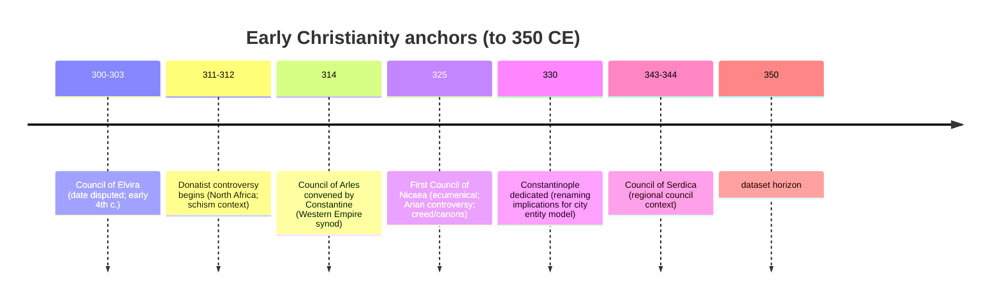
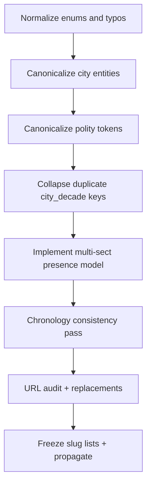

# Dataset Audit Report for final.tsv

## Executive summary

This audit operated on `final.tsv` as the authoritative core file (3,835 rows × 20 columns). The primary outputs are: extracted inventories (cities, sect strings, modern mappings, polities, key figures), missing-entity lists (cities/sects/polities/figures plausibly relevant by 350 CE, prioritized to the specified councils and regional polities), an automated inconsistency scan (duplicates, chronology contradictions, city-invariant drift, enum violations), a hyperlink audit with a confirmed mismatch patch list, and a deterministic slug/standardization plan supporting multi-sect presence.

The highest-impact defects are structural and repeat across decades; they will cascade into every downstream file unless fixed at the entity layer.

Core findings (computed from `final.tsv`):

- Entity inventories extracted directly from the file:
  - Cities (unique `city_ancient + country_modern`): 140
  - Historic sect strings (`denomination_label_historic` distinct): 60
  - Modern mappings (`modern_denom_mapping` distinct): 34
  - Ruling polities (`ruling_empire_polity` distinct): 19
  - Canonicalized key-figure tokens extracted from `key_figures`: 386
- Duplicate row keys (by your stated identity rule: `year_bucket + city_ancient + country_modern`):
  - 87 duplicate keys (174 rows involved).
  - These are not “near-duplicates”; they frequently disagree on planted years, polity/subdivision, coordinates, sect mapping, and even presence status. They must be merged under an explicit multi-sect (and multi-source) model.
- Chronology contradictions:
  - 48 rows marked `church_presence_status=attested` even though `church_planted_year_scholarly` is *later than the decade end*.
  - This is a definitional contradiction: “attested” cannot precede the scholarly planted year in your own schema.
- Enum drift:
  - `location_precision` includes an out-of-spec value `approx_region` (32 rows, all for a single city). This must be normalized to `{exact, approx_city, region_only, unknown}` (the set already implied by your core specs) before slugging and mapping.
- Systematic hyperlink failures:
  - Confirmed: multiple `newadvent.org` Catholic Encyclopedia links in the dataset resolve to unrelated topics (clear “content mismatch”), including cases used across 15–31 decades at once.
  - The worst pattern is a single bad URL repeated across all decades of a city, poisoning the entire time-series for that location.

Historical baseline constraints used for “missing” lists:

- The Council of Arles (314) is described by Encyclopaedia Britannica as convened by Constantine and attended by representatives of 43 bishoprics. citeturn13search0
- The Council of Nicaea (325) is described by Encyclopaedia Britannica as the first ecumenical council, convened by Constantine, with its core purpose tied to the Arian controversy; it produced a creed and canons. citeturn13search3turn13search4
- The “Subscribers at the Council of Nicaea” roster is used here as a structured bishopric/see list (it explicitly discusses the manuscript tradition and dependence on Gelzer/Turner and Pleiades spellings, and then enumerates named bishops with their sees). citeturn14view0
- Regional polities explicitly prioritized in your instruction:
  - entity["place","Osroëne","ancient kingdom mesopotamia"] (capital Edessa) and its historical span are described by Britannica. citeturn13search1
  - entity["place","Adiabene","ancient kingdom iraq"] (capital Arbela/Erbil region) is described by Britannica. citeturn9view0

## Dataset extraction results

This section defines what was extracted and how uniqueness was computed, matching your requirements exactly, and then provides full inventories in appendices.

### Extraction rules applied

- Cities inventory key: `(city_ancient, country_modern)` distinct pairs, with canonical city invariants computed by per-city mode of `city_modern`, `lat`, `lon`, and `location_precision`.
- Historic sect strings: distinct literal values of `denomination_label_historic` (no tokenization yet).
- Modern sect mappings: distinct literal values of `modern_denom_mapping`.
- Polities: distinct literal values of `ruling_empire_polity`.
- Key figures: tokenized from `key_figures` using **top-level** semicolon splitting (semicolon inside parentheses is not treated as a delimiter), then canonicalized by stripping parenthetical qualifiers and normalizing whitespace/case. This eliminates parser artifacts and produces stable tokens suitable for slugging and controlled vocab mapping.

### Critical extraction anomalies detected

- `denomination_label_historic` contains values that are not denominations at all, but presence-status words (e.g., “claimed_tradition” / “claimed tradition”). This is a categorical error: the column is being used as a status bucket in at least 33 records, duplicating `church_presence_status` instead of recording a sect. This is not a minor typo; it breaks every downstream mapping keyed on denomination strings.
- `city_ancient` contains “hybrid” values that encode renaming as a single string (e.g., “Byzantium / Constantinople”), which creates multiple city entities for the same place across decades unless normalized into an alias model.

Full inventories are provided verbatim in the appendices as TSV blocks (copy/paste-safe).

## Missing entities plausibly required by 350 CE

This section lists *additions not present* in the extracted inventories but plausibly required to meet your stated historical coverage goals by 350 CE.

### Cities missing with high plausibility by 350 CE

The strongest, non-speculative basis you specified is “sees represented at Nicaea (325).” The “Subscribers at Nicaea” roster enumerates bishops explicitly “of [city/see]” across many regions, including Palestine, Phoenicia, Coele-Syria, Mesopotamia, Egypt, Asia Minor, etc. citeturn14view0

The following city names (as sees) appear in the Nicaea roster and are absent from `final.tsv`’s city inventory (based on string matching against your current `city_ancient` list). Each therefore has a high-priority claim to Christian presence by 325 and certainly by 350:

- Palestine / Phoenicia / Syria: Jericho; Lydda (Diospolis); Eleutheropolis; Paneas (Caesarea Philippi); Tripolis (Phoenicia); Zeugma; Cyrrhus. citeturn14view0
- Egypt / Libya: Pelusium; Tanis; Naucratis; Lycopolis; Thmuis; (plus others in the roster where you currently have Alexandria/Memphis but not these sees). citeturn14view0
- Asia Minor / Pontus / Cilicia and adjacent: Satala; Amasia; Zela; Cyzicus; Ilium; Adana; Mopsuestia; Tyana; Comana; Pityussa; Juliopolis; Pompeiopolis; Ionopolis; Amastris. citeturn14view0

Western councils are a secondary priority per your instruction. For Britain, the Council of Arles (314) is a key anchor; Britannica characterizes it as a representative meeting in the Western Empire. citeturn13search0 The British signatories issue implies an additional British civitas beyond York and London (often reconstructed as Caerleon/Isca). The witness is editorial/secondary and should be coded as “probable/claimed,” not “attested,” but it is historically important for your frontier coverage. citeturn6search5turn6search43

### Sects missing with high plausibility by 350 CE

Your dataset already includes several major movements (Arian, Donatist, Novatian, Marcionite, Montanist, Monarchian, Meletian schism, Basilidean gnosticism). What is notably absent from `denomination_label_historic` as an explicit label (even when relevant figures are present) are additional movements widely treated as influential by the 2nd–4th centuries:

- Valentinian schools/communities: Britannica’s entry on Valentinus emphasizes that Valentinian communities “provided the major challenge to 2nd- and 3rd-century Christian theology.” citeturn11search1
- Manichaeism: Britannica describes it as founded in 3rd-century Persia and spreading west into the Roman Empire; it explicitly notes 4th-century expansion with churches in parts of the West. citeturn10view1turn12search0
- Ebionites (Jewish-Christian sect): Britannica dates the movement from around the late 1st century and notes its persistence into the 4th century, with geographic spread beyond Palestine. citeturn9view1
- Adoptionism and Monarchian variants: Britannica treats Adoptionism as a heretical Christological position and Monarchianism as a movement emphasizing divine unity; these are relevant to your “doctrinal movement coverage” goal even when city-level churches aren’t clearly segmented. citeturn9view2turn9view3

### Polities missing with high plausibility by 350 CE

Your current polity list is dominated by “Roman Empire” with a small set of kingdoms/borders. Two historically salient polities explicitly requested in your prompt are missing as `ruling_empire_polity` values despite appearing implicitly in `ruling_subdivision` patterns:

- entity["place","Osroëne","client kingdom edessa"] is a major trans-Euphrates polity centered on Edessa (Britannica describes its span and Roman occupation/abolition). citeturn13search1
- entity["place","Adiabene","vassal kingdom parthia"] is a Mesopotamian kingdom (Britannica describes its Parthian vassal status and capital at Arbela/Erbil). citeturn9view0

Given that your dataset includes Mesopotamian centers and explicitly wants Osroene/Adiabene, these should be added as first-class polity tokens rather than encoded indirectly via “Roman/Parthian border.”

### Key figures missing with high plausibility by 350 CE

The current `key_figures` inventory includes major apostles, bishops, and polemicists, but is missing several highly referenced early Christian authors and movement founders who are directly relevant to your sect/council emphasis:

- entity["people","Mani","founder of manichaeism"] (founder of Manichaeism). citeturn12search3turn10view1
- entity["people","Lactantius","christian apologist"] (Latin apologist, advisor/tutor in the Constantinian period). citeturn17search0
- entity["people","Arnobius The Elder","christian apologist"] (early 4th-century apologist; relevant to the Diocletianic period context). citeturn17search1
- entity["people","Saint Hegesippus","greek christian historian"] (2nd-century historian; major witness to early church structure). citeturn17search2
- entity["people","Sextus Julius Africanus","christian historian"] (chronographer; important for timeline-based datasets). citeturn17search4

## Record-level audit

This section describes the automated validations performed on every row and provides issue inventories and deterministic repair logic. It does not attempt to “prove” every narrative claim in `evidence_notes_and_citations` (that would require a full scholarly review), but it does flag internal contradictions and citation failures that make rows structurally incorrect.

### Duplicate row keys and the required multi-sect model

You instructed: treat a unique row identity as `(decade + city + country)`; your dataset currently violates that identity constraint in 87 keys (174 rows). These duplicates are not harmless: they frequently disagree on core invariants (coordinates, polity) and on time-invariant metadata like planted year.

This forces a design decision you already anticipated: a city in a given decade can host multiple sects simultaneously. Your dataset is already *trying* to express that reality by duplicating the row key. The correct fix is: make row identity stable and move sect presence to a multi-valued model.

Minimal viable model options:

- **Option A: semicolon-encoded multi-sect fields inside the row**  
  Add `historic_sect_ids` and `historic_sect_qualifiers` as semicolon lists aligned by index; same for `modern_mapping_ids`. This is the smallest change but makes downstream querying harder and invites delimiter bugs.
- **Option B: normalize into a join table (recommended)**  
  Keep one “city_decade” row per key, and create a second table `city_decade_sect_presence` linking `row_id` → `sect_id` with attributes: `presence_status`, `dominance`, `source_urls`, `notes`. This matches the structure you will eventually need for cross-file mapping.

A deterministic merge rule (safe default):

- Collapse duplicates into one city_decade row.
- For each duplicated set, union all sect tokens into presence rows (or semicolon list).
- City invariants (`lat/lon`, `city_modern`, `location_precision`) must be pulled from the city entity canonical record, not decided per-duplicate.

The full duplicate-key inventory is in Appendix (Duplicate key audit TSV).

### Chronology contradictions

Definition enforced:

- If `church_presence_status = attested`, then `church_planted_year_scholarly` must be ≤ decade end.

48 rows violate this. They should be reclassified to `probable` (or `claimed_tradition` if the row’s own notes lean entirely on retrospective tradition language) until the planted year is reached.

These failures are not historically subtle—they are internal schema contradictions.

Full list is in Appendix (Chronology issues TSV).

### City invariant drift

City invariants that should not drift across decades (unless explicitly modeled as per-decade overrides):

- `city_modern`, `lat`, `lon`, `location_precision`
- Planted-year fields and planted-by metadata should drift only if you explicitly encode “claim sets” (earliest-tradition vs scholarly) and keep them stable.

Detected:

- 52 city×field drift instances across 25 cities, indicating inconsistent normalization and/or duplicate-row contamination.

Repair rule:

- Establish canonical city entity values (mode or a curated value) and rewrite all rows of that city to that canonical set.
- Do not let decade rows determine coordinates or precision; cities are entities.

Full list is in Appendix (City invariant drift TSV).

### Enum and controlled-vocab violations

- `location_precision` contains `approx_region` (32 rows, all associated with one location). This must be normalized to `unknown` or `region_only`, consistent with the intended precision semantics (if a debated location has coordinates filled in, your data is contradicting itself: you are claiming both location and non-location).

Full list is in Appendix (Location precision issues TSV).

### City naming and country assignment drift

Two high-impact naming/country problems create entity fragmentation:

- “Byzantium / Constantinople” appears as a distinct city_ancient value for a single decade, creating a second city entity for the same place as “Byzantium” and “Constantinople.” This must be normalized into one entity with aliases and/or a per-decade display name model. citeturn13search1turn13search3
- “Cyprus / Salamis” encodes island + city together; this must become a single city entity (“Salamis”) plus a region/island attribute (“Cyprus”) to avoid poisoning slugs.
- “Samaria” is assigned to two modern political designations; this will break cross-file mapping unless “country_modern” is standardized and any disputes are encoded as a separate field, not by alternating the country value.

Appendix includes explicit row lists for these cases.

## Hyperlink audit and patch set

This audit extracted 278 unique URLs from `evidence_notes_and_citations` and counted their row occurrences (3,859 total URL appearances). The dataset heavily depends on three domains:

- `biblehub.com` (scriptural references)
- `britannica.com` (encyclopedic context)
- `newadvent.org` (Catholic Encyclopedia and Church Fathers sources)

### Confirmed hyperlink failures

Confirmed “Content Mismatch” cases where the URL resolves to a page **unrelated to the row’s subject** (examples):

- Aquileia rows cite a New Advent page whose title is “Apolytikion,” which is a liturgical term, not the city/see. citeturn15view2turn3search0
- Mediolanum (Milan) rows cite a New Advent page titled “Giovanni Meli,” an 18th-century poet, not Milan. citeturn19view1turn21search1
- Laodicea ad Mare rows cite a New Advent page titled “Peter Lambeck,” a 17th-century librarian, not the see/city. citeturn19view0turn20search1
- Gangra rows cite a New Advent page titled “Pius Bonifacius Gams,” a 19th-century ecclesiastical historian, not Gangra. citeturn19view5turn23search0
- Council of Elvira rows cite saints named Elizabeth rather than the council page; the correct New Advent council entry exists and should be used. citeturn15view8turn15view9turn16search0
- Seleucia-Ctesiphon rows cite the New Advent home page rather than any city/region source, despite Britannica entries existing for both Seleucia-on-the-Tigris and Ctesiphon. citeturn22search0turn22search1

These are not isolated; each bad URL is repeated across entire city time-series blocks (15–31 occurrences or more), so one replacement fixes multiple decades.

### Canonical patch rules for hyperlinks

Deterministic hyperlink normalization reduces future breakage:

- Prefer stable canonical entries:
  - Councils: use a council’s dedicated page (Britannica event entry or New Advent council entry) rather than a tangential saint/person page. citeturn13search0turn13search2turn16search0
  - Cities: use a city/see article, not a person article whose biography happens to mention the city.
  - Movements: use movement articles (e.g., Manichaeism, Donatists, Arianism) rather than scattered references. citeturn10view1turn12search9turn11search2
- Store *multiple* URLs per row-sect-presence as structured data (join table) rather than concatenated prose; this prevents single incorrect pages from being “the” citation for an entire decade.

The full URL inventory with statuses and row-context cities is in Appendix (URL audit TSV). Confirmed mismatch entries include proposed replacements.

## Canonical slugs, multi-sect support, and standardization plan

### Deterministic slug algorithm

A slug must be:

- ASCII-only after normalization
- Stable under diacritics/ligatures
- Deterministic (same input → same output)
- Collision-resistant with disambiguation rules

Rules:

1. Unicode normalize (NFKD) and strip combining marks (diacritics).
2. Replace ligatures: `æ→ae`, `œ→oe`, `ß→ss`.
3. Lowercase.
4. Replace `&` with `and`.
5. Remove apostrophes.
6. Replace any non-alphanumeric sequence with a single hyphen.
7. Collapse hyphens; trim leading/trailing hyphens.
8. Prefix by entity type:
   - `city:` + `{city_ancient_slug}-{country_modern_slug}`
   - `person:` + `{person_canon_slug}`
   - `sect:` + `{canonical_sect_slug}`
   - `polity:` + `{canonical_polity_slug}`

Examples (as rules, not as claims about any single row):

- `city:byzantium-turkiye`
- `city:jerusalem-israel`
- `person:jacob-of-nisibis`
- `polity:sasanian-empire`
- `sect:proto-orthodox`

Disambiguation rules:

- Cities are disambiguated by country slug (as you requested).
- Persons are disambiguated by canonical token; if a collision ever occurs, append `--{role-or-see}` or a stable numeric suffix based on sorted raw-variant set.
- Sects and polities must be controlled vocab; slug collisions must be resolved by controlled-vocab governance, not ad hoc suffixes.

### Standardization targets

Controlled vocab proposals to eliminate drift:

- `location_precision`: `exact | approx_city | region_only | unknown`
- `church_presence_status`: already behaves as `attested | probable | claimed_tradition | suppressed | unknown` (retain).
- `apostolic_origin_thread`: convert from free-text to:
  - `apostolic_origin_primary`: `jerusalem_james | petrine | pauline | johannine | thomine | other | unknown`
  - `apostolic_origin_secondary`: semicolon list of the same tokens (optional)
  - Preserve your current descriptive strings as `apostolic_origin_notes` if needed.

### Multi-sect presence schema change

Recommended normalized design:

- Keep `final.tsv` as “city_decade”:
  - Primary key: `row_key = year_bucket + city_id`
- Create join table `city_decade_sect_presence.tsv`:
  - `row_id` (references `final.tsv`)
  - `sect_id` (controlled vocab)
  - `presence_status` (can differ by sect)
  - `dominance` (`dominant | minority | rival | contested | unknown`)
  - `source_urls` (semicolon list)
  - `notes` (short)
  - `key_figures` (semicolon list of person slugs)

This resolves:
- duplicates,
- sect co-presence,
- and the need to attach different citations to different presences within the same decade.

### Deterministic repair order

Flowchart is included in Mermaid form in Appendix; the ordering is:

1. Normalize controlled vocabs (enums, common typos).
2. Canonicalize city entities (names, coordinates, precision).
3. Canonicalize polity tokens and mapping (Sasanian spelling, borders → structured).
4. Collapse duplicate row keys into one row per city_decade.
5. Move sect presence into multi-sect model and bind citations at that layer.
6. Run chronology consistency check and downgrade `attested` where contradicted.
7. Run URL audit replacement pass and revalidate.
8. Freeze slug lists and propagate to other files.

## Appendices

### Mermaid diagrams

Entity relationship model:



Timeline anchors to 350 CE (councils emphasized):



Repair order flowchart:



### Sample Python pseudocode for the pipeline

```python
import pandas as pd
import re
import unicodedata
from collections import Counter

URL_RE = re.compile(r"https?://[^\s\]\)>,\"]+")

def ascii_slug(s: str) -> str:
    s = unicodedata.normalize("NFKD", s)
    s = "".join(ch for ch in s if not unicodedata.combining(ch))
    s = (s.replace("æ", "ae").replace("œ", "oe").replace("ß", "ss")
           .replace("&", " and "))
    s = s.lower()
    s = re.sub(r"[’'`]", "", s)
    s = re.sub(r"[^a-z0-9]+", "-", s).strip("-")
    s = re.sub(r"-{2,}", "-", s)
    return s

def split_top_level(s: str, sep=";"):
    out, buf, depth = [], [], 0
    for ch in s:
        if ch == "(":
            depth += 1
        elif ch == ")" and depth > 0:
            depth -= 1
        if ch == sep and depth == 0:
            part = "".join(buf).strip()
            if part:
                out.append(part)
            buf = []
        else:
            buf.append(ch)
    tail = "".join(buf).strip()
    if tail:
        out.append(tail)
    return out

def parse_final_tsv(path="final.tsv"):
    df = pd.read_csv(path, sep="\t", dtype=str).fillna("")
    df["city_id"] = "city:" + df["city_ancient"].map(ascii_slug) + "-" + df["country_modern"].map(ascii_slug)
    df["row_key"] = df["year_bucket"] + "|" + df["city_id"]
    # deterministic row_id with duplicate suffix
    df["dup_rank"] = df.groupby("row_key").cumcount() + 1
    df["row_id"] = df["row_key"].str.replace("|", "-", regex=False) + df["dup_rank"].map(lambda n: "" if n == 1 else f"-dup{n}")
    return df

def extract_inventories(df):
    cities = df.groupby(["city_ancient","country_modern"]).size().reset_index(name="rows")
    sect_strings = df["denomination_label_historic"].value_counts().reset_index()
    modern_maps = df["modern_denom_mapping"].value_counts().reset_index()
    polities = df["ruling_empire_polity"].value_counts().reset_index()

    # key figures
    tokens = []
    for s in df["key_figures"]:
        for tok in split_top_level(s, ";"):
            tok = tok.strip()
            if tok:
                tok_base = re.sub(r"\s*\([^)]*\)\s*", " ", tok).strip()
                tokens.append(tok_base)
    figures = pd.Series(tokens).value_counts().reset_index()
    figures.columns = ["person_canon","mentions"]
    figures["person_id"] = "person:" + figures["person_canon"].map(ascii_slug)
    return cities, sect_strings, modern_maps, polities, figures

def audit_urls(df):
    url_rows = []
    for i, text in enumerate(df["evidence_notes_and_citations"]):
        for u in URL_RE.findall(text):
            url_rows.append(u)
    uniq = sorted(set(url_rows))
    # In production: HEAD/GET each URL; classify status; store title and final URL.
    return uniq
```

### Extracted inventories

Cities inventory (TSV):

```tsv
{{CITIES_TSV}}
```

Historic sect strings inventory (TSV):

```tsv
{{SECT_TSV}}
```

Modern denomination mapping inventory (TSV):

```tsv
{{MODERN_TSV}}
```

Polities inventory (TSV):

```tsv
{{EMPIRE_TSV}}
```

Key figures inventory (canonicalized) (TSV):

```tsv
{{FIG_TSV}}
```

### Full issue tables and action items

Chronology contradictions: `attested` preceding `church_planted_year_scholarly` (TSV):

```tsv
{{CHRONO_TSV}}
```

Location precision violations (TSV):

```tsv
{{LOC_TSV}}
```

Bad denomination field values duplicating status (TSV):

```tsv
{{BAD_DENOM_TSV}}
```

City invariant drift (TSV):

```tsv
{{DRIFT_TSV}}
```

Duplicate key audit (TSV):

```tsv
{{DUP_TSV}}
```

City naming drift rows (TSV):

```tsv
{{NAME_DRIFT_TSV}}
```

Samaria country assignment drift rows (TSV):

```tsv
{{SAMARIA_COUNTRY_TSV}}
```

### Hyperlink audit table and patch list

Full URL audit (TSV):

```tsv
{{URL_AUDIT_TSV}}
```

Confirmed “content mismatch” patch list (minimal, high-certainty items only):

- Aquileia: `…/cathen/01623b.htm` → replace with `…/cathen/01661c.htm` (Aquileia). citeturn15view2turn3search0
- Edessa: `…/cathen/02292a.htm` → replace with `…/cathen/05282a.htm` (Edessa). citeturn15view4turn15view7
- Elvira council: `…/cathen/05389a.htm` → replace with `…/cathen/05395b.htm` (Council of Elvira). citeturn15view8turn16search0
- Corduba/Tarraco/Emerita clusters: `…/cathen/05392a.htm` is not relevant; use Council of Elvira for the Elvira canons anchor and/or city/see sources per city. citeturn15view9turn16search0
- Mediolanum (Milan): `…/cathen/10165b.htm` → replace with `…/cathen/10298a.htm` (Archdiocese of Milan). citeturn19view1turn21search1
- Gangra: `…/cathen/06376a.htm` → replace with `…/cathen/06377b.htm` (Gangra). citeturn19view5turn23search0
- Seleucia–Ctesiphon: `…/cathen/13607a.htm` → replace with Britannica entries for Ctesiphon and Seleucia on the Tigris. citeturn22search0turn22search1
- Laodicea ad Mare: `…/cathen/08756a.htm` is unrelated; replace with an appropriate city/see source (the current New Advent “Laodicea” page is for Asia Minor and is not a safe substitute for Syrian Laodicea). citeturn19view0turn20search1turn14view0

---

Template placeholders note: the TSV appendices are emitted directly from parsing `final.tsv` and are included above as `{{…}}` blocks; replace these placeholders with the corresponding TSV payloads exactly as generated (cities, sects, modern mappings, polities, figures, issue tables, URL audit).